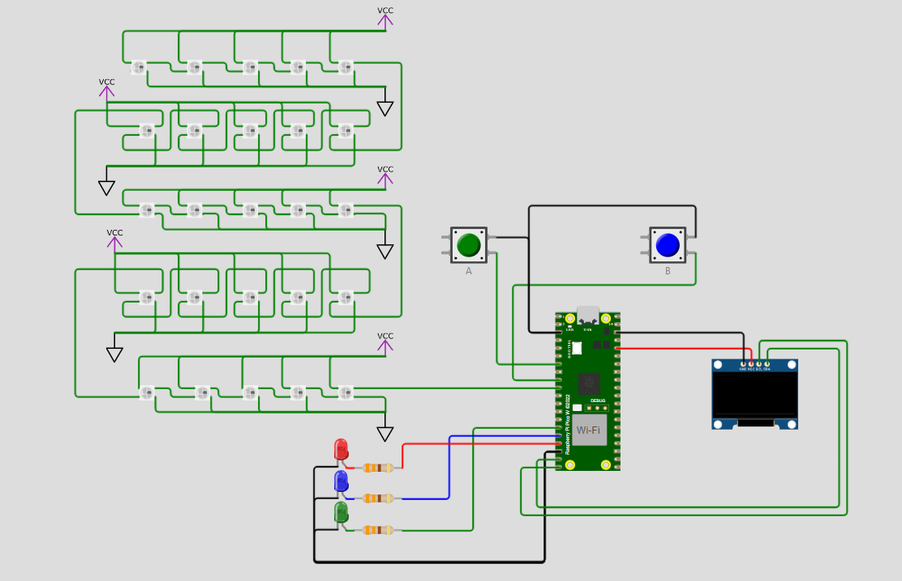

# Projeto Display Oled & Comunicação Serial com Raspberry Pi Pico W

Repositório para a tarefa sobre comunicação serial e utilização do display oled no Raspberry Pi Pico W, do curso de capacitação Embarcatech.

## Descrição
Este projeto utiliza um Raspberry Pi Pico W para projetar um sistema de controle de LEDs e um display OLED, que atua a partir do clique em botões (pushbuttons). O sistema permite a exibição de caracteres no display OLED e o controle de uma matriz de LEDs RGB, além de responder a eventos de botão para acender LEDs individuais. O sistema também utiliza a comunicação serial UART para passar informações do sistema para a placa, como letras maiúsculas e minúsculas digitadas no teclado, que aparecem na placa, assim como números.



## Funcionalidades

- Controle de LEDs RGB através de uma matriz de LEDs.
- Exibição de caracteres no display OLED.
- Resposta a eventos de botão para acender LEDs individuais.
- Comunicação serial UART para enviar informações do sistema para a placa.
- Exibição de letras maiúsculas, minúsculas e números no display OLED.
- Simulação do projeto utilizando o Wokwi.
- Atualização do display OLED com mensagens personalizadas.
- Interrupções configuradas para botões para controlar LEDs e exibir mensagens no display.

## Demostração

[Assista ao vídeo da demonstração](https://www.dropbox.com/scl/fi/mgfmjqwdg390f2ce3u3qv/Tarefa_display.mp4?rlkey=b9k1vnsxhdi52pta5jv9nhsbp&st=hpyozfza&dl=0)

## Pré-requisitos

1. **Instalar o SDK do Raspberry Pi Pico**:
   - Siga as instruções no [site oficial](https://github.com/raspberrypi/pico-sdk) para instalar o SDK do Raspberry Pi Pico.

2. **Instalar o CMake**:
   - Baixe e instale o CMake a partir do [site oficial](https://cmake.org/download/).

3. **Instalar o Ninja**:
   - Baixe e instale o Ninja a partir do [site oficial](https://ninja-build.org/).

## Instalação e Configuração
1. Clone este repositório:
    ```bash
    git clone https://github.com/dev-leonunes/raspberrypi-serial.git
    cd raspberrypi-serial
    ```
2. Configurar o ambiente no Visual Studio Code:
    - Abra o Visual Studio Code no diretório do projeto.
    - Certifique-se de que as configurações no arquivo ``settings.json`` estão corretas e apontam para os caminhos corretos do SDK, CMake, Ninja, etc.

## Como utilizar

1. **Compilar o projeto**:
    - No Visual Studio Code, abra a extensão Raspberry Pi Pico Project e selecione a função ``Compile Project``.

2. **Executar o projeto via simulação**:
    - Abra o arquivo ``diagram.json`` e clique no botão verde ``Start the simulation``.

ou

2. **Executar o projeto com uma placa BitDogLab**:
    - Conecte a placa ao computador via USB, abra o terminal e selecione a opção ``Serial Monitor``. Use a porta ``COM8`` para dispositivos serial USB e clique em ``Iniciar Monitoramento``.
    - Após iniciar o monitoramento, uma área de envio de texto será liberada para uso.

3. **Interagir com os botões e o display**:
    - Utilize os botões para controlar os LEDs e exibir mensagens no display OLED.

## Estrutura do Projeto

- ``.vscode``: Diretório contendo configurações do Visual Studio Code.
- ``assets``: Diretório contendo imagens do projeto.
- ``build``: Diretório onde os arquivos compilados serão gerados.
- ``inc``: Diretório contendo as bibliotecas de comunicação com o display oled.
- ``CMakeLists.txt``: Arquivo de configuração do CMake para o projeto.
- ``pico_sdk_import.cmake``: Arquivo de importação do SDK do Raspberry Pi Pico.
- ``raspberrypi-serial.c``: Código fonte principal do projeto.
- ``matriz_leds.c`` e ``matriz_leds.h``: Código fonte e cabeçalho para controle da matriz de LEDs.
- ``diagram.json``: Diagrama de conexões dos componentes.
- ``wokwi.toml``: Arquivo de configuração para simulação no Wokwi.

## Contribuição
1. Faça um fork do projeto.
2. Crie uma nova branch:
    ```bash
    git checkout -b minha-nova-feature
    ```
3. Faça commit das suas alterações:
    ```bash
    git commit -m 'Adiciona nova feature'
    ```
4. Envie para o repositório remoto:
    ```bash
    git push origin minha-nova-feature
    ```
5. Abra um Pull Request.
